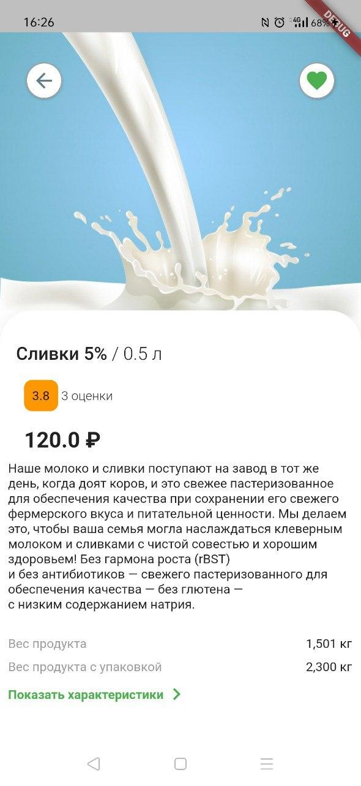
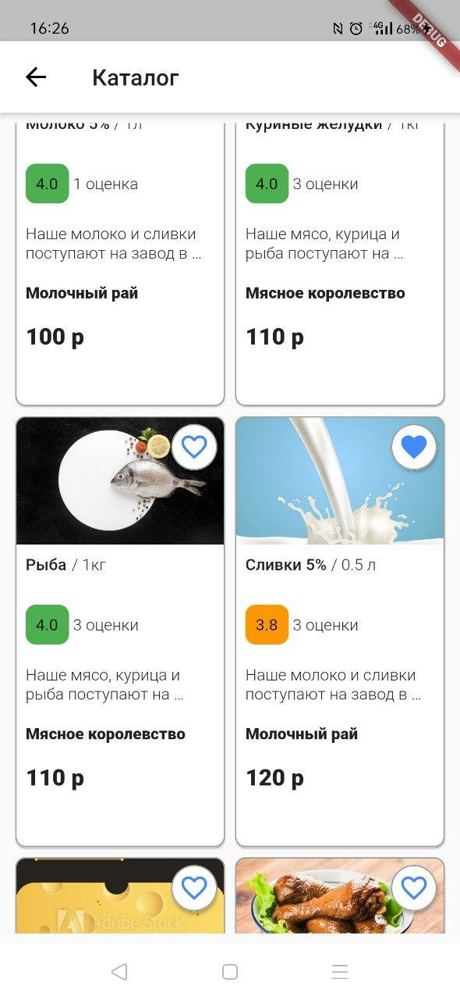
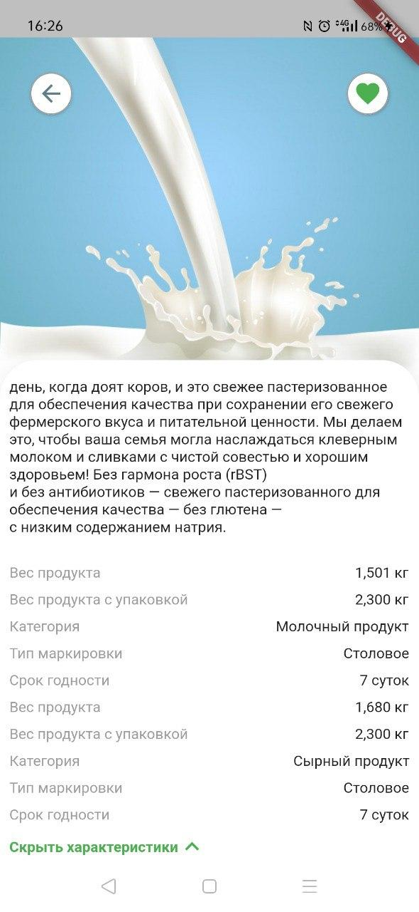
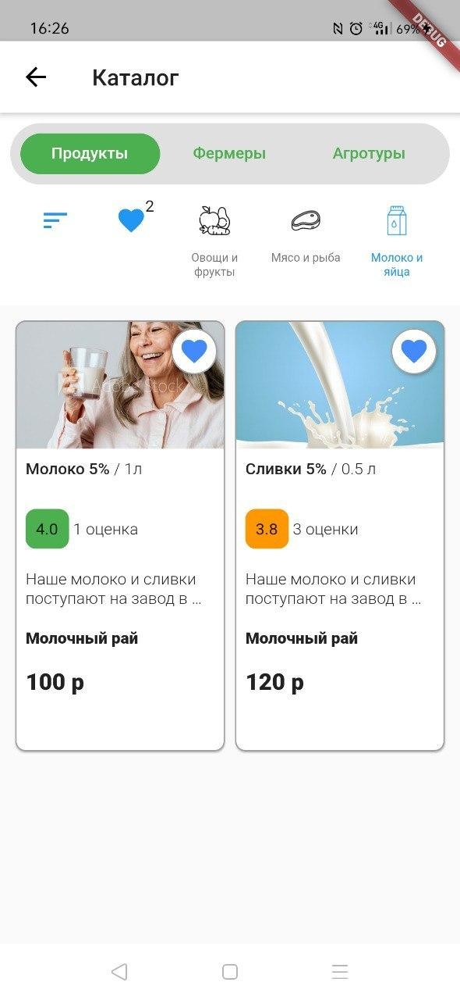

# Тестовое задание для РСХБ-Интех

Работа сделана согласно [ТЗ](https://docs.google.com/document/d/1yLhaFMSEdxWThxvEqFQgYOjwxgkDHjiMnD9YFwNEg7w/edit).

Версия Flutter: **Flutter (Channel stable, 1.20.2, on Linux, locale en_US.UTF-8)**

Версия Dart: **Dart SDK version: 2.9.1 (stable) (Wed Aug 12 12:37:19 2020 +0200) on "linux_x64"**

Проверка для iOS сделана при помощи Codemagic -> VNC -> виртуальной машины iOS с XCode 11.6.

По времени план - 20 часов, уложился в срок. Помогло наличие шаблонного кода в других проектах.

В качестве CI/CD использовался CodeMagic.

Для запуска на Android [скачать артефакт из гитхаба](https://github.com/ValeriusGC/flutter_rshb_sample/releases/tag/v.0.1.0).
Для запуска на iOS: [Runner.app](https://github.com/ValeriusGC/flutter_rshb_sample/blob/dev/docs/Runner.app).

**Android:**

    
    
    
    
    

    

**iOS:**

    
    
    
    
    

    

- [Трелло](https://trello.com/b/tERK8BLB/%D1%80%D1%81%D1%85%D0%B1-%D1%82%D0%B5%D1%81%D1%82%D0%BE%D0%B2%D0%BE%D0%B5-%D0%B7%D0%B0%D0%B4%D0%B0%D0%BD%D0%B8%D0%B5)
- [Гитхаб](https://github.com/ValeriusGC/flutter_rshb_sample)

