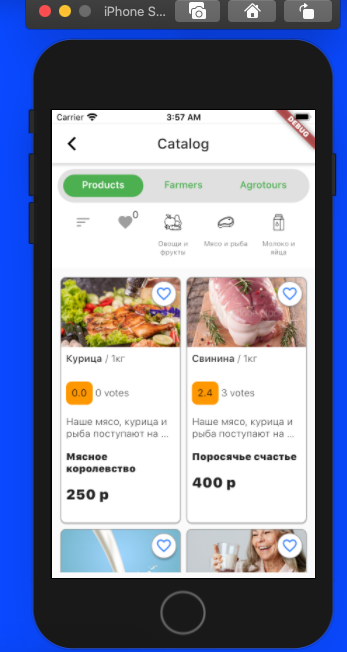

# Тестовое задание для РСХБ-Интех

Работа сделана согласно ТЗ.

Проверка для iOS сделана при помощи Codemagic -> VNC -> виртуальной машины iOS с XCode 11.6.

По времени план - 20 часов, уложился в срок. Помогло наличие шаблонного кода в других проектах.

В качестве CI/CD использовался CodeMagic.

Для запуска на Android можно [скачать артефакт из гитхаба](https://github.com/ValeriusGC/flutter_rshb_sample/releases/tag/v.0.1.0).

**Android:**

**iOS:**

- [Трелло](https://trello.com/b/tERK8BLB/%D1%80%D1%81%D1%85%D0%B1-%D1%82%D0%B5%D1%81%D1%82%D0%BE%D0%B2%D0%BE%D0%B5-%D0%B7%D0%B0%D0%B4%D0%B0%D0%BD%D0%B8%D0%B5)
- [Гитхаб](https://github.com/ValeriusGC/flutter_rshb_sample)

